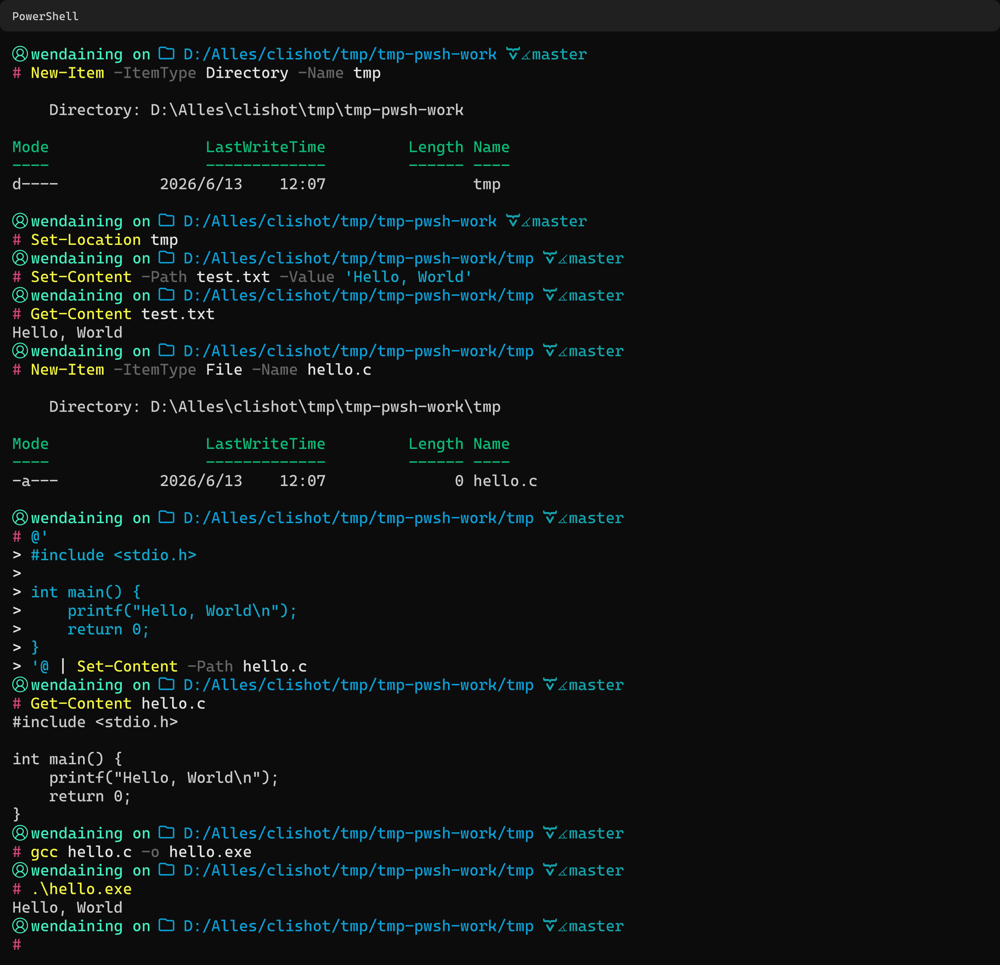
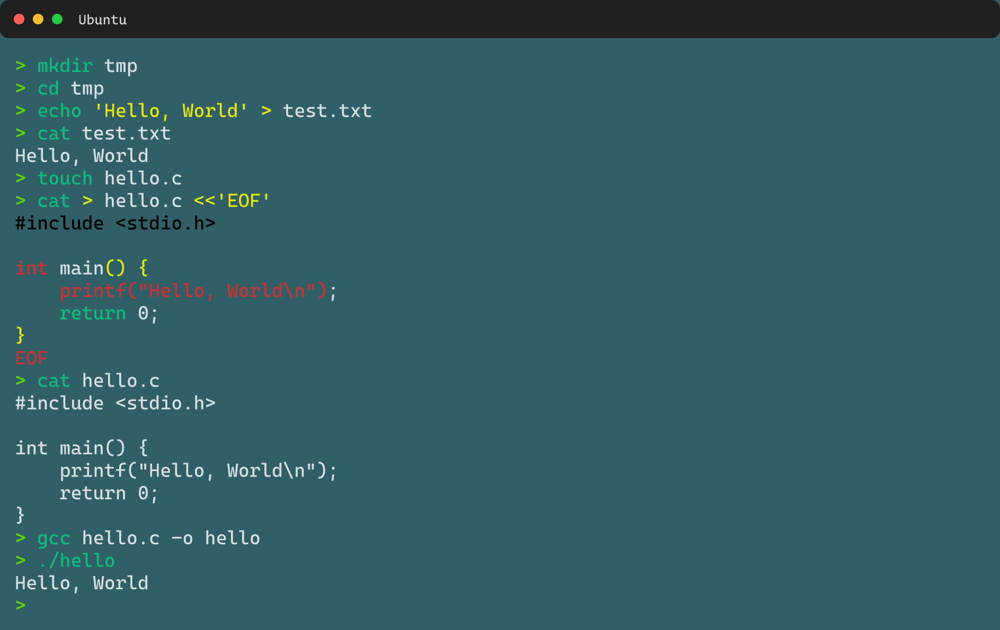

# clishot


`clishot` 是一个通过 YAML 编写真实的终端命令作为驱动，基于用户本机真实的终端生成**伪终端截图**的工具。适合 Agent 自动化工作流。

clishot 构建在 [termless](https://github.com/beorn/termless) 之上，使用 [termless](https://github.com/beorn/termless) core 作为终端自动化和渲染引擎。感谢 [termless](https://github.com/beorn/termless) 项目及其贡献者。

## 为什么选择 clishot？

- **完整终端客制化** — 兼容 OhMyPosh、OhMyZSH、Starship 等一切你正在使用的 shell 主题和插件。
- **真实 ANSI 解析** — 读取终端原生 ANSI 转义序列，而非像素级截图拼接。
- **为 Agent 而生** — YAML 驱动、无头运行、结果确定；从设计之初就面向 AI Agent 自动化工作流。

## 实例

这些图片都是由本项目程序生成的，通过读取真实终端运行的字节流构建。





## 从仓库开始使用

可以直接 clone、安装依赖、构建 CLI，然后运行自带示例：

```bash
git clone <repo-url> clishot
cd clishot
npm install
npm run build
node dist/cli/index.js doctor
node dist/cli/index.js record examples/hello.yml --out tmp/hello.png --force
```

生成的图片会写到 `tmp/hello.png`。内部调试产物会放在 `tmp/tmp-*` 下，并且不会进入 Git。

开发时也可以把本地 CLI link 到全局：

```bash
npm link
clishot doctor
clishot record examples/hello.yml --out tmp/hello.png --force
```

## 作为 CLI 安装

```bash
npm install -g clishot
```

如果是从 npm 安装，可以直接使用 `clishot` 命令：

```bash
clishot doctor
clishot record examples/hello.yml --out tmp/hello.png --force
```

## 基础用法

```bash
clishot record examples/hello.yml --out figures/hello.png
clishot validate examples/hello.yml
clishot doctor
clishot version
```

`record` 必须传入 `--out`。最终主截图路径由 CLI 指定，不写在 YAML 里。

## YAML 示例

```yaml
shell:
  program: pwsh
  args: ["-NoLogo"]

terminal:
  cols: 100
  rows: 30

appearance:
  output:
    scale: 2

capture:
  mode: fullScrollback

steps:
  - type: send
    text: "python --version"
    enter: true
    waitFor:
      idleMs: 800
```

具体规范参考 [SPEC](./SPEC.md) 和 [SKILL.md](../skills/clishot/SKILL.md)

## 命令

```bash
clishot record <spec-file> --out <output-file>
clishot validate <spec-file> [--check-runtime]
clishot doctor
clishot version
clishot inspect <capture-dir>
clishot clean <capture-dir>
```

支持 `png`、`jpg`、`jpeg`、`webp`、`svg`。默认格式是 `png`；如果输出扩展名不同，需要显式传入 `--format`。

```bash
clishot record demo.yml --out figures/demo.webp --format webp
```

中途截图通过 screenshot step 生成：

```yaml
steps:
  - type: send
    text: "gcc main.c -o main"
    enter: true
    waitFor:
      idleMs: 800
  - type: screenshot
    name: "after-compile"
```

```bash
clishot record demo.yml --out figures/final.png --shots-dir figures/steps
```

## 错误策略

终端内部命令输出的错误属于终端内容，不会默认导致 clishot 失败。例如编译错误、Python traceback、测试失败都应被正常截图。

clishot 只在配置错误、shell 启动失败、waitFor 超时、termless core 不可用、渲染失败或输出写入失败时返回非零。失败时会保留 `tmp/tmp-<timestamp>-<spec>/` 调试产物。

## 跨平台说明

Windows 默认推断 `pwsh -NoLogo`。Linux 和 macOS 默认使用 `$SHELL` 或 `bash`。WSL 通过显式 `shell.program: wsl.exe` 配置支持。

## Agent Skill

仓库提供面向 Agent 的 Skill：`skills/clishot/SKILL.md`。当 AI Agent 需要生成 clishot YAML、运行 `clishot record`、把截图插入报告，或排查失败的 capture 时，应优先阅读并遵守这个 Skill。

Skill 只是操作指南，不会增加新的运行时功能。普通用户也可以把它当作一份精简工作流说明；参与本仓库开发的 Agent 还应同时阅读 `docs/SPEC.md` 和 `docs/git-rule.md`。

## License

MIT
